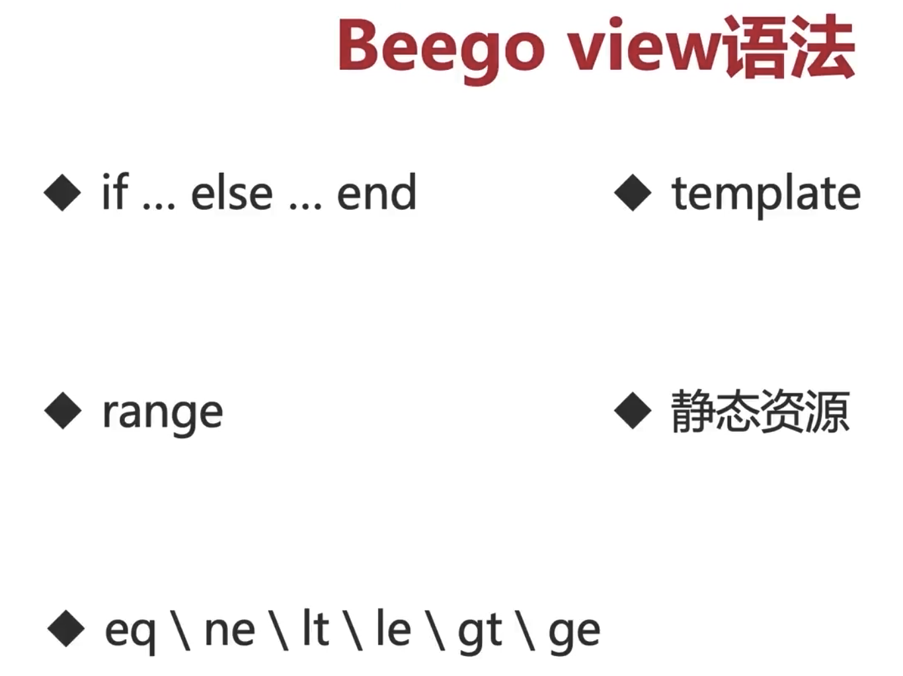
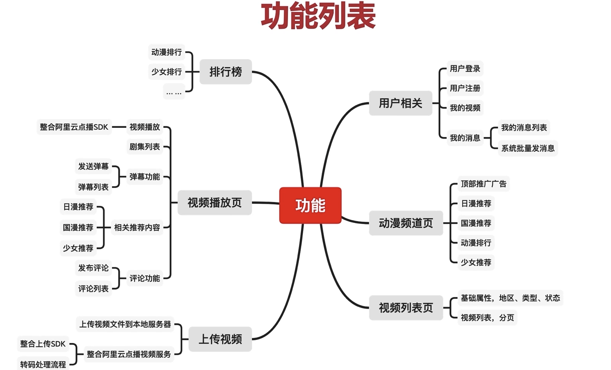

# Youku

## 基础知识

### MVC架构

MVC架构即将应用程序分为三个部分:模型Model,视图View和控制器Controller.
* 模型Model:表示数据和应用层的逻辑,包括数据库,数据结构,业务规则等等.
* 视图（View）：负责展示用户界面。它是用户看到和与之交互的界面。它通常由 HTML/CSS/JS 组成。
* 控制器（Controller）：负责将用户界面和数据模型分开。它是一个中介者，处理用户的请求并调用模型来处理它们。然后，它根据数据的状态更新视图。

优势:

* 可重用性:每个组件（模型、视图、控制器）都是可重用的，因此可以在多个应用程序中使用它们。
* 易于维护：因为每个组件都是单独的，所以在修改其中一个组件时，不会影响到其他组件。
* 更好的可扩展性：可以添加新的模型、视图或控制器，而不会影响到其他组件。

​		假设一个 Web 应用程序需要显示一个用户的个人资料信息。用户通过浏览器发起请求，服务器将请求传递给控制器C。控制器C读取用户数据并调用模型M来处理数据，这可能涉及到从数据库中读取用户数据或进行其他处理。然后，控制器将数据传递给视图V，视图将数据渲染为 HTML/CSS/JS 并将响应返回给用户。

!!! 一般Model负责处理数据. C负责接收用户请求,并根据请求调用Model中的方法获取数据,返回对应的V.

!!! 数据库id自增是由数据库引擎所决定的,不能够手动删除id最大值

### 过滤器

作用:

* IP屏蔽
* Token验证
* 访问地址屏蔽

API 

```go
beego.InserFilter(pattern string,position int,filter FilterFunc,skip ...bool)
```

## Beego View语法



## ORM

ORM 即(Object-Relation Mapping,对象关系映射),将对象模型和关系数据库之间的数据转换工作自动化。它允许开发人员使用面向对象的方式来访问和操作数据库，而不需要编写任何SQL语句。ORM可以让开发人员将精力集中于业务逻辑和应用程序的实现上，而不是数据访问和存储细节。

ORM框架通常会提供一些工具和技术，如数据迁移、事务管理、查询构建器、缓存和连接池等，来帮助开发人员更轻松地管理和操作数据。

Beego的ORM使用了Go语言自带的database/sql包来实现对数据库的访问，同时也集成了第三方ORM库Xorm。

```bash
go get github.com/astaxie/beego/orm
```

`.All()`、`.One()`、`.Values()`等方法是Beego ORM提供的用于执行SQL查询的方法，具体作用如下：

- .All(dest interface{}, fields ...string) (int64, error)

​		执行SQL查询，并将查询结果存储到指定的**切片对象`dest`**中，返回查询结果的数量和错误信息。参数`fields`指定了需要查询的字段名，默认查询所有字段。

- .One(dest interface{}, fields ...string) error

​		执行SQL查询，并将查询结果存储到指定的**单个结构体对象`dest`**中，返回错误信息。

- .Values(results *[]Params, fields ...string) (int64, error)

​		执行SQL查询，并将查询结果存储到**指定的`[]Params`对象`results`中**，返回查询结果的数量和错误信息。

## 功能列表



所有的接口信息都在 route/app.php目录下

## 开始改造

!!!"github.com/go-sql-driver/mysql" 在注册驱动的时候需要先import

### 改造注册和登录功能

* 整理注册接口的参数和返回值
* 分析注册功能的业务逻辑
* 实现功能

```php
//登录接口
Route::post('login/do', 'UserController/loginDo');
//注册接口
Route::post('register/save', 'UserController/saveRegister');
```

```php
/**
     * 通过手机号和密码登录
     * @param string $mobile
     * @param string $password
     * @return \think\response\Json
     */
    public function loginDo()
    {
    	try{
	        //获取手机号
	        //获取密码
	        $mobile = Request::post('mobile', '');
	        $password = Request::post('password', '');
	        if(!$mobile){
	        	throw new \Exception("手机号不能为空");
	        }
	        if(!$password){
	        	throw new \Exception("密码不能为空");
	        }
	        if(!isMobile($mobile)){
	        	throw new \Exception("手机号格式不正确");
	        }
	        $rs = User::isMobileLogin($mobile, Md5V($password));
	        if($rs){
	        	returnSuccess([
	        		'uid' => $rs['id'], 
	        		'name' => $rs['name']
	        	]);
	        }
	        throw new \Exception("手机号或密码不正确");
    	} catch (\Exception $e) {
		    returnError(5000, $e->getMessage());
		}
    }

    /**
     * 注册用户
     * @param string $mobile
     * @param string $password
     * @return \think\response\Json
     */
    public function saveRegister(){
    	try{
	        //获取手机号
	        //获取密码
	        $mobile = Request::post('mobile', '');
	        $password = Request::post('password', '');
	        if(!$mobile){
	        	throw new \Exception("手机号不能为空");
	        }
	        if(!$password){
	        	throw new \Exception("密码不能为空");
	        }
	        if(!isMobile($mobile)){
	        	throw new \Exception("手机号格式不正确");
	        }
	        $rs = User::isUserMobile($mobile);
	        if($rs){
	        	throw new \Exception("手机号已经注册");
	        } else {
	        	$rs = User::userSave($mobile, Md5V($password));
	        	if($rs){
	        		returnSuccess('注册成功');
	        	}
	        }
	        throw new \Exception("注册失败，请联系客服");
    	} catch (\Exception $e) {
		    returnError(5000, $e->getMessage());
		}
    }

```


